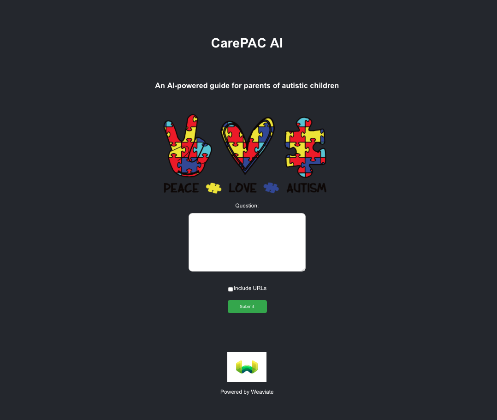
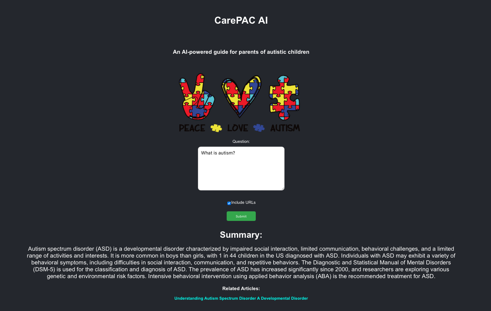

# CarePAC AI

CarePAC AI is an AI-powered guide for parents of autistic children.

The underlying articles were downloaded from the Center for Autism and Related Disorders via web scraping in `load_data/load_data_to_weaviate.py`.

The backend is a Flask API that queries a Weaviate vectorstore with a question from the user.

The front end is a simple React app.

To get started:
1. Create a new environment and run: `pip install -r requirements.txt`
2. Create a `.env` file for your Weaviate Cloud and OpenAI credentials, similar to:
```
WEAVIATE_CLUSTER_URL=https://your-cluster-url
WEAVIATE_API_KEY=your-weaviate-api-key
OPENAI_API_KEY=your-openai-api-key
```
3. Start up the backend: `weaviate-flask-backend/app.py`
4. Start up the frontend: `cd weaviate-react-frontend` then `npm start`

Here are example screenshots of the app:





There are plenty of improvements to be made but this is a good starting point to create something with AI that can have a real impact in people's lives.